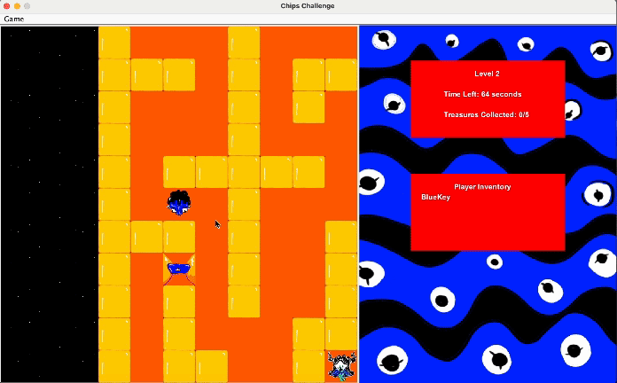

# Swen Project

# Gameplay

# Setup

- Clone Gitlab repository
- Look at 'How to Set-Up' in 'Plan' to see libraries needed to run program

If game does not compile properly make sure layout looks like this
//images of intelliJ project setup

# Members

Thomas Wilton 
- Module: Rendering
- GitlabUser: wiltonthom

Philip Sparrow
- Module: Persistency
- GitlabUser: sparrophil

Tom Green
- Module: Appppp
- GitlabUser: greenthom

Bernard Del Puerto
- Module: Recorder
- GitlabUser: delpubern

Judah Dabora
- Module: Domain
- GitlabUser: daborajuda 

FOR CLARIFICATION ON WHAT TO DO
https://docs.google.com/document/d/10db0AYja3VS4YWOqzggL2a_mPp2-a7ZyczQQzn2DOuE/edit

# Module

Game Logic
- Chap can never stand on a wall
- The total number of treasures (collected/uncollected) is constant during the play of a given level
- The total number of treasures is non-negative
- If a treasure has been collected, the number of treasures still on the board is reduced by one
- If Chap stands on a locked door, then it must have collected the correct key

Domain
- Shows the maze
- Elements of the maze
- Interactions throughout the maze
- Implement tiles and images throughout the levels
- Maintaining game state
- Implementing game logic
- Locations of player, objects
- Game controls

App
- GUI (SWING)
- Domain.Player can see the maze and interact using keystrokes
- Display time left to play
- Display current level
- Keys collected
- Number of treasures stilll to be collected
- JMenuBar: pause, exit, starting screen....
- Countdown: each level has specific time to play it in - replay current level if 0
- CTRL-X: exit game / current game state lost / next time game started then resume from last unfinished level
- CTRL-S: exit game / saves game state / game will resume next time application started
- CTRL-R: resume saved game / pop-up file selector to select saved game to be loaded
- CTRL-1: start new game at level 1
- CTRL-2: start new game at level 2
- SPACE: pauce game and display "GAME IS PAUSED"
- ESC: close "GAME IS PAUSED" dialog and resume game
- UP, DOWN, LEFT, RIGHT: moving character

Rendering
- View of the maze
- Drawing maze??
- Updated after each move in order to display the current 'panel'
- Animations so movement looks smooth (OPTIONAL)
- Sound effects (OPTIONAL)

Persistency
- Loads levels from JSON files (level 1/level 2)
-- Convert game state into JSON to save and back again to play
- Level Design
- Work with rendering on this 

Recorder
- Record gameplay and store it in a file (JSON)
- Load recorded game and replay it
- UI: step-by-step / auto / set speed replay

Testing
- Code Coverage: EMMA/Jacoco (IntelliJ)
- SpotBugs (IntelliJ)
- IDE Reference Browser / Dependency Analysis

# Marking Guide

Playability(Group Mark)
- Program follows logic and is playable

GitLab(Group Mark)
- GitLab issue tracking system is used to plan projects, assign tasks, including bugfixes

Documentation(Group Mark)
- Javadocs (Needed)
- UML Diagram (Needed)
- CRC (Optional)
- State Diagram (Optional)

# Module Quality Criteria

Domain
- Test coverage of doman package (running tests in module only)
- At least 80% usage or pre and post condition checks

Appppp
- Visual Appeal
- Timeout functionality
- Consistency

Renderer
- Originality (more than a clone of original game)
- Visual Appeal
- Consistency
- Smoothness of transitions
- Sound effects

Persistency
- Use of JSON
- Load and save <1s
- Test coverage (80%)

Recorder
- Features implemented
- Step-by-step
- Auto-replay
- Set replay speed

# How To Play

Here are the Objectives of the Game: 
- Collect all the Treasures to Complete the Level. 
- Collect the Keys to Unlock the Doors. 
- Complete the Level Within the Time Limit. 

Here are the Keys for the Game: 
- You can move Chaps Using the Arrow Keys. 
- To Pause the Game Press the SPACEBAR. 
- To Resume the Game Press ESC. 
- To Load a Game Press CNTRL-L. 
- To Save a Game Press CNTRL-S. 
- To Start Recording a Game Go to Menu Bar. 
- To Exit the Application Press CNTRL-X. 

For Running Recorder 
- To Start Recording during a Game Go to Menu Bar.
- Click Save Recorder and give your recording a name. 
- To Load a Recording go back to the Menu Screen. 
- You can Select your Saved Recording. 
- You can select if you want it to Autoplay or Step-By-Step. 
- For Auto Replay use the buttons to increase/slow down the speed. 
- For Step-By-Step use the buttons to display next/previous move. 

